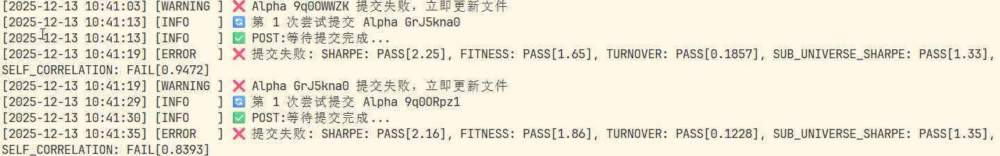

# WorldQuant Brain Alpha 完整工作流



## 项目简介

整合 alpha-tools 回测功能 + Alpha 提交功能，实现 **回测 → 筛选 → 提交** 一键完成

> 告别从成千上万次回测中在平台上一个个挑选并检测SC因子的烦恼！

## 功能特性

- ✅ 自动认证登录 WorldQuant Brain API
- 🔬 **批量回测** - 从表达式列表自动回测多个 Alpha
- 🔍 **智能筛选** - 严格检查 6 项核心指标全部 PASS
- 📊 6 项核心指标：
  - LOW_SHARPE（夏普率 ≥ 1.25）
  - LOW_FITNESS（适应度 ≥ 1.0）
  - LOW_TURNOVER（低换手率）
  - HIGH_TURNOVER（高换手率 ≤ 0.70）
  - CONCENTRATED_WEIGHT（权重集中度）
  - LOW_SUB_UNIVERSE_SHARPE（子宇宙夏普率）
- ⚡ **批量中性化回测** - 筛选后直接批量测试多种中性化组合
- 🚀 **一键工作流** - 回测 + 筛选 + 中性化 + 提交全自动
- 💾 自动维护未提交 Alpha 列表
- 📝 完善的日志系统
- 🛡️ 程序中断保护
- 🌐 Web 管理界面 - Streamlit 可视化操作

## 项目结构

```
worldquant-autocommit-alpha/
├── __init__.py                # 包初始化，导出所有模块
├── main.py                    # 主程序入口
├── logger.py                  # 日志系统
├── api_client.py              # WorldQuant Brain API 客户端
├── filter.py                  # Alpha 合格筛选逻辑
├── batch_tester.py            # 批量回测器
├── neutralization_tester.py   # 中性化组合测试器
├── importer.py                # 导入功能
├── submit.py                  # 提交功能
├── workflow.py                # 一键工作流
├── brain_credentials_copy.txt  # 账号密码配置文件
├── .env                       # 环境变量配置（可选）
├── logs/                      # 日志目录（自动生成）
├── data/                      # 数据目录
│   ├── alphas/               # Alpha 表达式
│   │   └── to_test.txt       # 待回测列表
│   ├── results/              # 回测结果
│   └── qualified/            # 达标 Alpha
├── web/                       # Web 管理界面
│   ├── app.py                # Streamlit 主入口
│   ├── api_server.py         # Flask API 服务器
│   ├── pages/                # 页面模块
│   │   ├── filter.py         # 筛选与中性化
│   │   ├── backtest.py       # 批量回测
│   │   └── neutralization.py # 独立中性化测试
│   └── api/                  # API 路由
└── README.md
```

### 模块说明

| 模块 | 功能 |
|------|------|
| `logger.py` | 统一日志系统 |
| `api_client.py` | API 认证、模拟、提交 |
| `filter.py` | 6 项指标筛选逻辑 |
| `batch_tester.py` | 批量回测器 |
| `neutralization_tester.py` | 中性化组合测试器 |
| `importer.py` | 导入 CSV/JSON 结果 |
| `submit.py` | 批量提交 |
| `workflow.py` | 一键工作流 |
| `web/app.py` | Streamlit Web 界面 |
| `web/api_server.py` | Flask REST API |

## 安装步骤

### 1. 安装依赖

```bash
pip install requests pandas python-dotenv
```

### 2. 目录初始化

```bash
# 程序会自动创建以下目录
mkdir -p data/alphas data/results data/qualified logs
```

### 2. 配置账号密码

**方式一：环境变量（推荐）**

创建 `.env` 文件：
```bash
WORLDSQUANT_USERNAME=你的邮箱@example.com
WORLDSQUANT_PASSWORD=你的密码
```

**方式二：配置文件**

编辑 `brain_credentials_copy.txt`：
```json
["你的邮箱@example.com", "你的密码"]
```

## 使用方法

### 方式一：Web 界面（推荐）

```bash
python main.py
```

启动后访问：
- **前端**: http://localhost:8501
- **API**: http://localhost:5000

Web 界面功能：
- 🔬 **批量回测** - 提交和管理回测任务
- 🔍 **筛选与中性化** - 筛选达标 Alpha，支持批量中性化回测
- 📤 **提交** - 一键提交合格 Alpha

### 方式二：批量回测

```bash
python alpha_commit.py
```

选择选项 `1`，程序会：
1. 从 `data/alphas/to_test.txt` 加载 Alpha 表达式
2. 逐个回测并记录结果
3. 保存到 `data/results/` 和 `data/qualified/`

### 方式三：一键工作流（推荐）

```bash
python alpha_commit.py
```

选择选项 `4`，程序自动完成：
```
Step 1: 批量回测 (从 data/alphas/to_test.txt)
Step 2: 筛选合格 Alpha (6 项指标全部 PASS)
Step 3: 提交到 WorldQuant Brain
```

### 方式四：导入并提交

选择选项 `5`，可从以下来源导入：
- alpha-tools 结果目录
- 本地 `data/results/` 目录
- 自定义路径

导入后询问是否立即提交。

### 批量中性化回测（Web 界面）

1. 进入"筛选与导出"页面
2. 设置筛选条件，查看达标 Alpha
3. 勾选需要中性化的 Alpha
4. 选择区域和 maxTrade 模式
5. 点击"批量中性化回测"
6. 查看所有中性化组合的结果

## Alpha 表达式格式

编辑 `data/alphas/to_test.txt`，每行一个 Alpha：

```
# 格式: 表达式 | Universe | Decay | Neutralization | Truncation
-rank(ts_zscore(returns, 20) * volume / adv20) | TOP3000 | 7 | SUBINDUSTRY | 0.02
rank(-returns) | TOP3000 | 5 | SUBINDUSTRY | 0.02
ts_mean(returns, 10) | TOP1000 | 3 | MARKET | 0.01
```

参数说明：
- **Universe**: TOP3000 / TOP1000 / TOP500 / TOP200
- **Decay**: 0, 3, 5, 7, 10
- **Neutralization**: SUBINDUSTRY / MARKET / SECTOR / INDUSTRY
- **Truncation**: 0.01 ~ 0.08

## 菜单选项

```
📋 请选择操作:
1: 批量回测 Alpha (从 data/alphas/to_test.txt)
2: 从 CSV 文件提取合格 Alpha 并保存
3: 提交已保存的合格 Alpha ID
4: 回测 -> 筛选 -> 提交 (一键完成)
5: 从 alpha-tools 或本地结果导入 (可选择提交)
```

## 工作流程图

```
┌─────────────────────────────────────────────────────────────┐
│  data/alphas/to_test.txt                                   │
│  (表达式列表)                                               │
└────────────────────────┬────────────────────────────────────┘
                         │
                         ▼
┌─────────────────────────────────────────────────────────────┐
│  1. 批量回测                                                │
│  - API 调用模拟                                             │
│  - 获取 Sharpe/Fitness/Turnover 等指标                       │
└────────────────────────┬────────────────────────────────────┘
                         │
                         ▼
┌─────────────────────────────────────────────────────────────┐
│  2. 筛选合格 Alpha (统一筛选函数)                            │
│  - 6 项指标全部 PASS                                        │
│  - 保存到 data/qualified/qualified_YYYYMMDD.json             │
└────────────────────────┬────────────────────────────────────┘
                         │
                         ▼
┌─────────────────────────────────────────────────────────────┐
│  3. 批量中性化回测 (可选)                                    │
│  - 测试所有中性化方式 × maxTrade 组合                         │
│  - 筛选优质 Alpha 并打标签                                   │
└────────────────────────┬────────────────────────────────────┘
                         │
                         ▼
┌─────────────────────────────────────────────────────────────┐
│  4. 提交到 WorldQuant Brain                                 │
│  - 批量提交合格 Alpha                                        │
│  - 自动重试 + SC 因子检测                                    │
└─────────────────────────────────────────────────────────────┘
```

## 常见问题

### 1. 认证失败

**解决**：检查 `.env` 或 `brain_credentials_copy.txt` 配置

### 2. 回测超时

**解决**：检查网络连接，或增加间隔时间

### 3. 没有达标 Alpha

**解决**：调整 Alpha 表达式参数（降低 Decay、调整 Truncation 等）

## 版本历史

### v0.5.0 - 中性化功能整合

- ✅ 筛选页面整合中性化功能
- ✅ 支持批量中性化回测
- ✅ 添加 `neutralization_tester.py` 中性化组合测试器
- ✅ Web 界面支持勾选 Alpha 批量操作
- ✅ 添加优质 Alpha 筛选条件（换手率/Sharpe/Margin）

### v0.4.0 - 统一重构

- ✅ 统一筛选逻辑 - 单一 `is_qualified_result()` 函数
- ✅ 统一目录结构 - `data/alphas/`, `data/results/`, `data/qualified/`
- ✅ 合并选项5和6 - 统一导入入口，导入后询问是否提交
- ✅ 支持多种数据来源（alpha-tools、本地、第三方路径）

### v0.3.0 - 整合版

- ✅ 整合 alpha-tools 批量回测功能
- ✅ 添加一键工作流（回测 → 筛选 → 提交）
- ✅ 统一认证方式

### v0.2.0 - 提交增强

- ✅ 失败详细诊断
- ✅ 日志系统
- ✅ 中断保护

### v0.1.0 - 初始版本

- ✅ 提交功能
